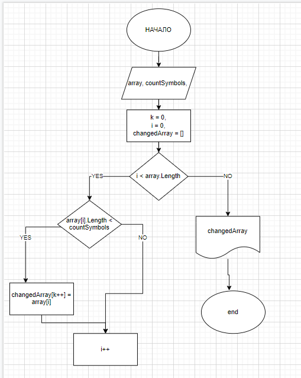

# test_task

1. метод **GetArray**   позволет получить массив с которым мы будем работать. 

        Если askUser == true, то элемента массива мы будем запрашивать у пользователя.

        Если  askUser == false, то вернем заготовленный
2.   метод **GetElementsByParam**  - основная логика.Позволяет получить новый массив        слов, отфильтрованный по кол-во символов.

        параметр __*array*__ - это наш начальный перебираемый массив.

        параметр __*countSymbols*__ - это кол-во символов по которым мы одбираем слова.

**АЛГОРИТМ =>**

3. метод **ShowArray**  - выводит массив на экран.

